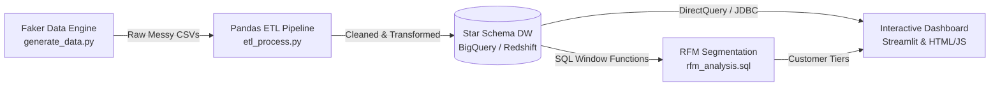

# 🛒 E-Commerce Sales Analytics & Data Warehouse Platform

[](https://www.python.org/)
[](https://pandas.pydata.org/)
[](https://cloud.google.com/bigquery)
[](https://powerbi.microsoft.com/)
[](https://www.docker.com/)
[](https://opensource.org/licenses/MIT)

> **An End-to-End Enterprise Data Engineering & Analytics Pipeline** simulating an e-commerce platform. From synthetic messy data generation and Pandas ETL pipelines to a Star Schema Cloud Data Warehouse (BigQuery / Redshift), advanced SQL RFM Customer Segmentation, and an interactive Executive BI Dashboard.

---

## 📌 Table of Contents
1. [Project Overview](#-project-overview)
2. [End-to-End Architecture](#-end-to-end-architecture)
3. [Key Features & Phases](#-key-features--phases)
4. [Data Warehouse Star Schema](#-data-warehouse-star-schema)
5. [RFM Customer Segmentation](#-rfm-customer-segmentation)
6. [Interactive BI Dashboard](#-interactive-bi-dashboard)
7. [Repository Structure](#-repository-structure)
8. [Quick Start & Setup](#-quick-start--setup)
9. [Skills Demonstrated](#-skills-demonstrated)

---

## 🎯 Project Overview

In a real-world enterprise, data arrives messy, distributed, and disconnected. This project solves that by building a full production-style analytics stack:

- **Raw Data Simulation**: Generates 500+ customers, 50 product SKUs across 5 categories, and 8,000+ orders spanning 2 years with realistic seasonality and anomalies.
- **Robust ETL Cleaning**: Programmatic handling of nulls, duplicates, mixed date formats, Unix timestamps, and corrupt monetary values.
- **Cloud Warehousing**: Modeled into a Kimball-style Star Schema with partition & cluster optimizations for BigQuery/Redshift.
- **Advanced Customer Analytics**: SQL-driven RFM (Recency, Frequency, Monetary) quintile scoring and automated tier classification.
- **Visual Intelligence**: Interactive web dashboard and Power BI / Tableau integration guides.

---

## 🏗 End-to-End Architecture



---

## 🚀 Key Features & Phases

### 🔹 Phase 1: Realistic Data Generation (`generate_data.py`)
- Simulates realistic user behavior using Python's `Faker`.
- Incorporates weekend purchasing spikes and Q4 holiday surge (November–December).
- Injects 5% real-world data imperfections: missing emails, duplicate signups, corrupted multi-format dates, and negative price errors.

### 🔹 Phase 2: Production ETL Pipeline (`etl_process.py` & `load_to_dw.py`)
- **Deduplication & Imputation**: Cleans customer records and replaces invalid emails.
- **Universal Date Parser**: Handles ISO formats, slash/hyphen dates, and Unix epochs.
- **Data Validation & Filtering**: Discards negative/zero transactions and calculates line-item and order totals.
- **Cloud Loader**: Idempotent batch insertion to Google BigQuery or AWS Redshift.

### 🔹 Phase 3: Data Warehouse Modeling (`schema.sql`)
- **Fact Table**: `fact_sales` (Grain: One row per line-item per order).
  - *BigQuery Optimization*: Partitioned by `DATE(order_date)` and Clustered by `(customer_id, product_id)`.
  - *Redshift Optimization*: Key distribution on `customer_id` and compound sort key on `(order_date, customer_id)`.
- **Dimension Tables**: `dim_customers`, `dim_products`.

### 🔹 Phase 4: RFM Customer Segmentation (`rfm_analysis.sql`)
Using SQL Common Table Expressions (CTEs) and window functions (`NTILE(5)`):

| Customer Tier | RFM Pattern | Business Strategy |
| :--- | :--- | :--- |
| 🏆 **Champions** | `R >= 4, F >= 4, M >= 4` | VIP rewards, early product access, ambassador programs |
| 💎 **Loyal Customers** | `R >= 3, F >= 3, M >= 3` | Upsell higher-tier products, loyalty discounts |
| 🌱 **New / Promising** | `R >= 4, F <= 2` | Onboarding email series, first-purchase follow-ups |
| ⚠️ **At Risk / Attention** | `R <= 2, F >= 3, M >= 3` | Personalized win-back campaigns, limited-time offers |
| 💤 **Lost Customers** | `R <= 2, F <= 2, M <= 2` | Re-engagement surveys, aggressive clearance promos |

### 🔹 Phase 5: Interactive BI Dashboard & On-Demand Reporting
- **Web Dashboard**: Modern dark-mode UI with live charts for revenue trends, product revenue by category, and customer segment distribution.
- **On-Demand Executive PDF Reporting**: Built-in 1-click exporter that compiles live KPI scorecards, RFM cohorts, and strategic recommendations into a downloadable PDF report.
- **Power BI / Tableau Guide**: Step-by-step connection guide in [`bi_connection_guide.md`](./bi_connection_guide.md).

---

## 📂 Repository Structure

```
.
├── index.html                # Phase 5: Executive BI Dashboard (with Live PDF & CSV Export)
├── dashboard.html            # Static dashboard mirror
├── data.json                 # Pre-aggregated analytics snapshot
├── vercel.json               # Vercel static deployment & CORS routing
├── netlify.toml              # Netlify configuration
├── schema.sql                # Phase 3: Star schema DDL with partitioning & clustering
├── rfm_analysis.sql          # Phase 4: RFM segmentation calculation using SQL window functions
├── bi_connection_guide.md    # Phase 5: Power BI & Tableau cloud warehouse connection manual
├── Dockerfile                # Containerization setup
├── docker-compose.yml        # Multi-container local orchestration
└── scripts/                  # Python Data Engineering & Server Backend
    ├── requirements.txt      # Python dependencies
    ├── generate_data.py      # Phase 1: Synthetic data generator with noise injection
    ├── etl_process.py        # Phase 2: Data cleaning, normalization, and star schema creation
    ├── load_to_dw.py         # Phase 2: Cloud warehouse ingestion (BigQuery / Redshift)
    ├── export_data.py        # Phase 2: Warehouse aggregation & JSON data exporter
    └── dashboard.py          # Phase 5: Production Python REST API & local web server
```

---

## ⚡ Quick Start & Setup

### 1. Clone the Repository
```bash
git clone <repository-url>
cd <repository-directory>
```

### 2. Install Dependencies
```bash
pip install -r scripts/requirements.txt
```

### 3. Run Data Generation & ETL
```bash
# Generate raw datasets (customers.csv, products.csv, orders.csv)
python scripts/generate_data.py

# Run ETL transformations (outputs dim_customers.csv, dim_products.csv, fact_sales.csv)
python scripts/etl_process.py
```

### 4. Launch the Dashboard
```bash
# Option A: Run Local Python Analytics Server
python scripts/dashboard.py

# Option B: Direct Browser View
# Open index.html directly in any modern web browser
```

---

## 💡 Key Skills Demonstrated

- **Languages**: Python (Pandas, NumPy, Faker), SQL (BigQuery, Redshift, PostgreSQL)
- **Data Engineering**: Data Extraction, Cleansing, Schema Design (Star Schema, Normalization), Data Modeling
- **Analytics & BI**: RFM Customer Segmentation, Cohort Analysis, Revenue Forecasting, Data Visualization
- **Cloud & DevOps**: Google BigQuery, AWS Redshift, Docker, Git, CI/CD Deployment

---

## 📄 License
This project is open-source under the [MIT License](LICENSE).
